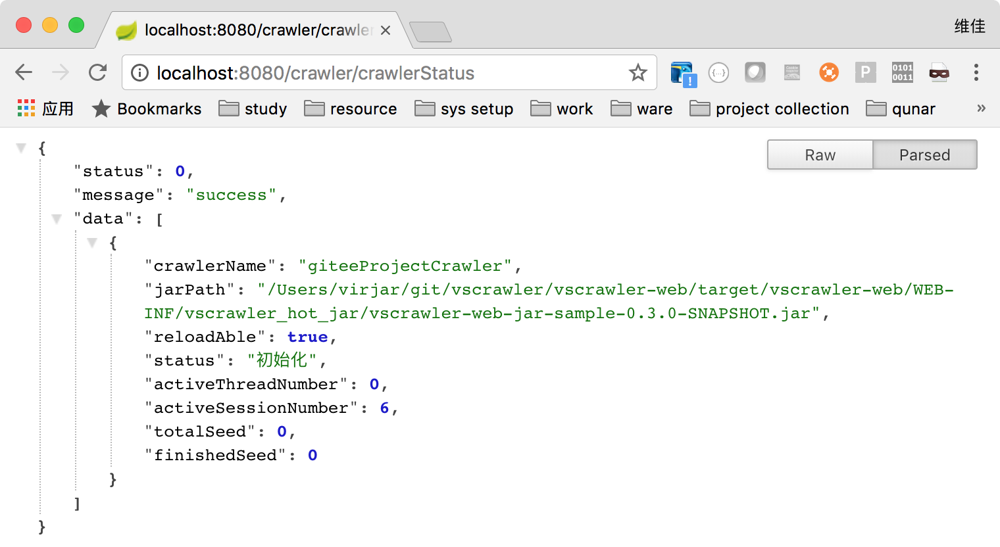

# 看文档,不吹逼,不被批
[http://vscrawler.virjar.com/](http://vscrawler.virjar.com/)
[http://vscrawler.scumall.com/](http://vscrawler.scumall.com/)

## maven坐标
```
<dependency>
      <groupId>com.virjar</groupId>
      <artifactId>vscrawler-core</artifactId>
      <version>0.2.6</version>
</dependency>
```


## QQ群：

569543649(VS系列统一交流群，目前包含DungProxy，VSCrawler，SipSoup三个项目)

### history

1. 0.0.x vs基础结构确定
2. 0.1.x 对数据抽取进行完整设计,包括xpath、链式抽取、字符串函数集、表格数据定位
3. 0.2.0 支持运行多个爬虫实例(context隔离)
4. 0.2.1 支持注解爬虫
5. 0.2.2 完整设计爬虫资源队列管理,处理资源的分发、封禁、解禁、多机器分发隔离,用来处理账号、设备号、token等可复用资源
6. 0.2.3-6 同步抓取接口,关于超时时间的各种优化(同步抓取系统需要实时性),自此vscrawler在离线抓取和在线抓取上面都得到了工程性的验证
7. 0.3.x web端的实现,除了常规框架支持的爬虫启停控制,还提供爬虫代码热替换、抓取封装为restful接口两个特色功能


演示
### 热加载
热加载是指框架可以在不停机的情况下,替换某个爬虫,此需求设计的出发点是,vscrawler在我司承载越来越多的在线抓取任务,因为爬虫越来越多,导致每次某个爬虫变动都需要重新发布线上机器,发布将会导致对应机器在短时间内无法服务,可能导致整套系统平均性能下降,甚至可能导致其他机器压力过大,引发雪崩。


### 在线抓取
我知道在很多公司写爬虫并不会用爬虫框架的,其中最主要的一个原因就是需求是在线抓取,爬虫框架不应该调度抓取任务(任务调度在上游),上游系统发现数据过期需要调抓取系统获取新鲜数据、上游系统决定任务热门冷门用来决定不同任务优先级、上游系统根据用户操作决定准实时刷新数据、上游系统负责相似任务消重(而非简单的种子是否相同确定消重规则)
等等很多需求,vscrawler支持放弃抓去任务调度权限,暴露在线抓取接口,仅仅实现抓去相关资源调度(ip,账号,设备号,session复用、tcp连接复用)、数据解析、


### vscrawler-web使用方法
1. 新建maven工程,导入依赖
```
<!-- 加入vscrawler api的依赖,但是依赖作用域是provided,其原理类似servlet-api -->
 <dependency>
     <groupId>com.virjar</groupId>
     <artifactId>vscrawler-web-api</artifactId>
     <version>${parent.version}</version>
     <!-- 请注意,scope需要是provided -->
     <scope>provided</scope>
 </dependency>
```
其他依赖也是可以导入

2. 定制pom,加入如下build代码
```
<plugin>
         <groupId>org.apache.maven.plugins</groupId>
         <artifactId>maven-shade-plugin</artifactId>
         <configuration>
             <minimizeJar>true</minimizeJar>
             <filters>
                 <filter>
                     <artifact>*:*</artifact>
                     <excludes>
                         <exclude>META-INF/**</exclude>
                     </excludes>
                 </filter>
             </filters>
         </configuration>
         <executions>
             <execution>
                 <phase>package</phase>
                 <goals>
                     <goal>shade</goal>
                 </goals>
             </execution>
         </executions>
</plugin>
```
3. 在项目里面书写爬虫代码,实现``com.virjar.vscrawler.web.api.CrawlerBuilder``

```
/**
 * Created by virjar on 2018/2/3.<br>
 * 这是一个简单的爬虫类,她可以使用maven打包成为一个jar包,然后上传到vscrawler web 平台,vscrawler-web将会对该jar包实现热加载
 */
public class SampleHotCrawler implements CrawlerBuilder {
    @Override
    public VSCrawler build() {
        return VSCrawlerBuilder.create()
                .setProcessor(AnnotationProcessorBuilder
                        .create()
                        .registryBean(GitEEProject.class)
                        .build())
                .setStopWhileTaskEmptyDuration(-1)
                .setCrawlerName("giteeProjectCrawler")
                .build();
    }
}

```

4. 使用maven打包工程,得到jar包 ``mvn clean package``
5. 将得到的jar包放置到web工程``WEB-INF/vscrawler_hot_jar/``目录下面,或者使用web页面在线上传
6. 此时可以开始在线爬虫测试了,或者可以通过web控制台启动离线抓取爬虫

### 热加载jar代码规则
1. 基本没有限制,想怎么写都可以,但是如果vscrawler本身引入了某个依赖的话,你自己引入的依赖将不会生效(受限于classloader双亲委派机制),所以如果vscrawler本身某个依赖版本存在问题,需要在web工程控制,在爬虫jar工程控制将不会生效。
2. 由于jar包只是一段代码,没法和spring容器配合,如依赖注入,aop等。但是现在业务线的代码几乎逃不开spring了,所以我又免为其难的支持了一部分spring的特性,具体包括简单的spring上下文感知``com.virjar.vscrawler.web.api.SpringContextAware``,如果你的爬虫入口类实现了这个接口,那么在框架加载你的jar包的时候,将会通过这个接口注入spring上下文,那你可以拿着它做一些事情(获取bean,刷新bean定义,或者类似于springMVC再做一个subContext),当然手动获取bean确实很傻的样子,所以如果jar里面的class字段标记了``Resource``或者``Autowired``任意一个注解,那么框架将会尝试使用spring上线的bean进行自动注入,注入方式只支持根据type(多个type的bean,将会出问题,因为实际工程实践中我们貌似都是根据type来注入的,那些花样玩儿法每个都支持太累了)。总之jar包可以拿到web工程的spring bean,但是jar包的class无法影响web工程的spring 上下文。web工程和jar包是单向依赖关系。
