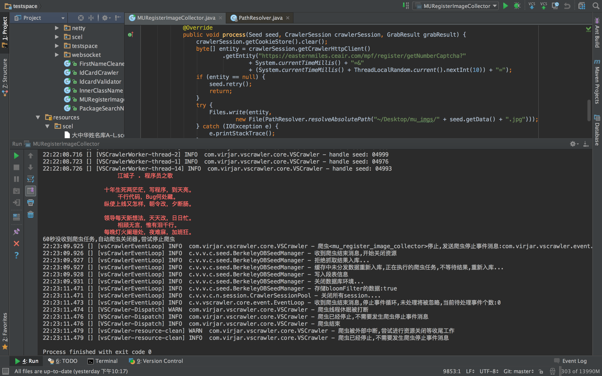
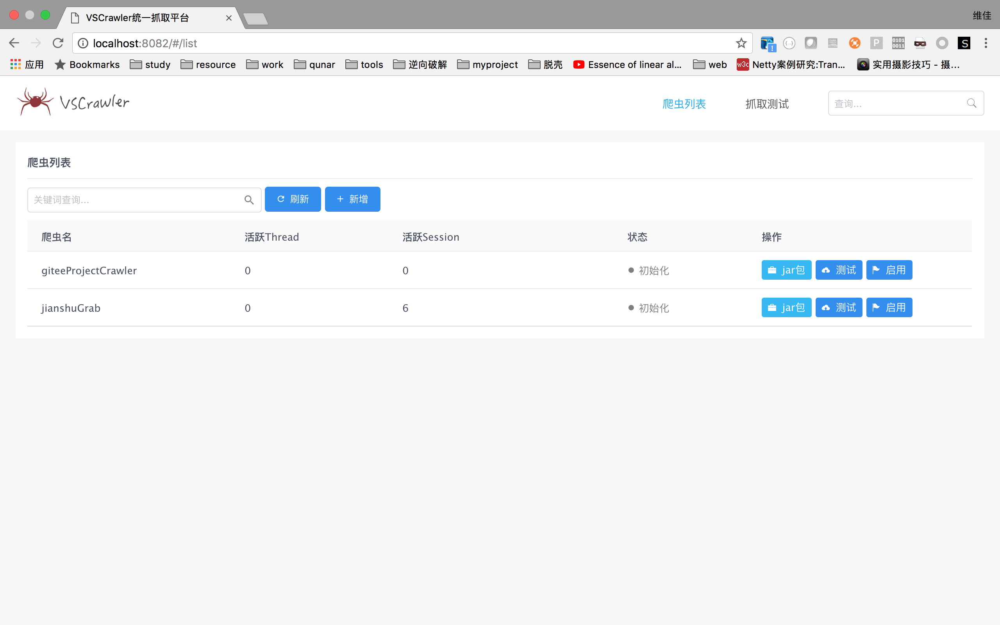
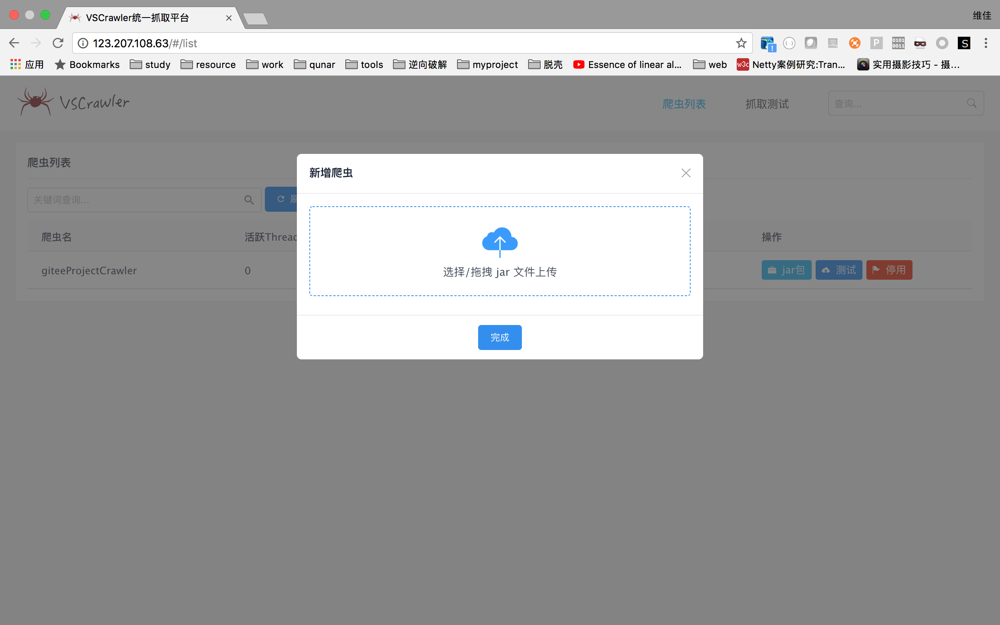
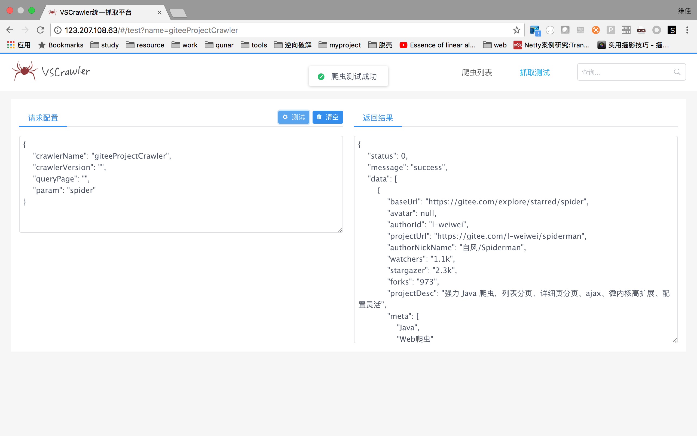
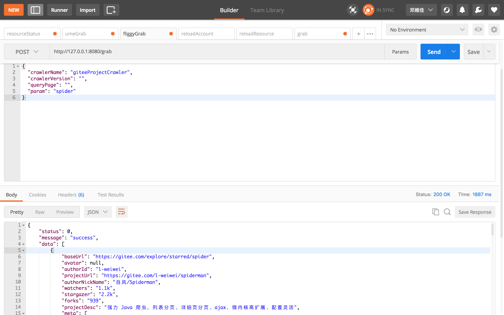

# vacrawler




# 看文档,不吹逼,不被批
[http://vscrawler.virjar.com/](http://vscrawler.virjar.com/)
[http://vscrawler.scumall.com/](http://vscrawler.scumall.com/)  
[在线测试地址](http://vscrawlerdemo.virjar.com/#/list)


## maven坐标
```
<dependency>
      <groupId>com.virjar</groupId>
      <artifactId>vscrawler-core</artifactId>
      <version>0.2.6</version>
</dependency>
```


## QQ群：

569543649(VS系列统一交流群，目前包含DungProxy，VSCrawler，SipSoup三个项目)

### history

1. 0.0.x vs基础结构确定
2. 0.1.x 对数据抽取进行完整设计,包括xpath、链式抽取、字符串函数集、表格数据定位
3. 0.2.0 支持运行多个爬虫实例(context隔离)
4. 0.2.1 支持注解爬虫
5. 0.2.2 完整设计爬虫资源队列管理,处理资源的分发、封禁、解禁、多机器分发隔离,用来处理账号、设备号、token等可复用资源
6. 0.2.3-6 同步抓取接口,关于超时时间的各种优化(同步抓取系统需要实时性),自此vscrawler在离线抓取和在线抓取上面都得到了工程性的验证
7. 0.3.x web端的实现,除了常规框架支持的爬虫启停控制,还提供爬虫代码热替换、抓取封装为restful接口两个特色功能

## 特色功能
1. session复用,完全隔离多个用户(目前其他框架大多无法处理多账户登录问题,只能填入单一cookie),vscrawler的session复用可以做到tcp链接隔离和复用
2. 可拆卸的插件扩展能力,vscrawler提供大量扩展点,甚至vscrawler本身就是基于插件模块驱动起来的。同时vscrawler的插件使用非常方便,vscrawle通过自建的eventBus构建了一个迷你RPC,接入插件就和普通的java方法无区别(感受一下dubbo,单进程RPC可能比dubbo在参数传递上面更加爽)
3. Xpath,vscrawler的xpath没有用任何第三方库,是我自己写的一套,她和vscrawler本身契合非常好。目前也就webmagic和SimCrawler两个java爬虫框架设计了自己的Xpath。但是vscrawler的xpath(SipSoup)比他们都强大,SipSoup是我研究了他们的Xpath模块后重新设计的。SipSoup可以在Xpath语法内部插入cssQuery规则,真的很方便啊
4. 链式抽取,黄大大说链式抽取让他感觉代码设计得有魔力似的,我也觉得是这样的。vscrawler的链式抽取功能相对于webmagic更加有魔力。这是因为webmagic的链式抽取有两个问题(1. 上下文在链式的节之间传递时会丢失。2.无法实现异构数据之间的链式)
5. 代理,讲真vscrawler内置dungproxy的代码量,已经超过了webmagic框架代码量。而且dungproxy自我大学三年级开始设计,到工作半年左右初步有一批用户大概花了一年半。里面内置很多算法模型。我很自信关于代理的调度理论完虐目前市面上任何基于扫描或者抓取的代理系统(如果谁和我讲她的代理扫描系统,我一般没有听下去的欲望,那些概念都是市面上能够查到的,没有一点儿新意)
6. 数据下载,我觉得大多数爬虫框架对数据下载封装太死了,而且是没有意义的封装。你说框架支持post、支持ajax。这个不是任何一个网络库都可以支持的么,提起来post之类的一般是实际场景下请求复杂了,框架的封装暴露接口太少,为了支持又不得不写大量逻辑。所以不封装多好
7. 断点续爬,你尝试过在没有redis的情况下,也能断点续爬么?话说,可能不少的研究生,或者本科毕业生有抓数据的需求吧。但是你们可能部署一台redis的资源都没有吧。试试vscrawler吧😄。效率比redis高。我就不信了,这年头没有redis不能活?
8. 资源队列,vscrawler把在dungproxy调度ip顺序的核心算法移植到了vscrawler的resourceManager模块,resourceManager拥有足够完美的资源管理算法,让你在面对账号这些可能登陆失败、可能临时封禁、可能网络异常导致封禁误判?本模型直接cover,不需要考虑不合理策略导致数据封死了或者没有封上的问题。
9. 注解爬虫,simCrawler和webmagic有注解模式的爬虫,用起来很方便。所以我得vscrawler也不能少啊,vscrawler的注解爬虫那肯定比他们的强大啊,我肯定看完了她们的代码再写自己的,站在巨人的肩上嘛。vscrawler的注解爬虫提供了她们没有的类型转换猜测、循环注入、链式组合规则(webmagic的链式无法用在注解上面,最主要是链式的上下文丢失问题,会导致抽数据的时候很奇怪的问题。我们下面都是Jsoup,在处理html片段的时候,会受到Jsoup的代码补全功能干扰)
10. 在线抓取,vscrawler可以放弃任务调度能力,直接暴露抓取接口,这样vscrawler只是一个单纯的抓取接口封装了。目前该功能以及和web项目整合,直接暴露了http接口。同时在线和离线可以共存(有同事让我离线抓取一批数据,然后等几天他又提需求说,需要服务化,做成在线接口,其实对于vscrawler来说两种模式切换没有工作量)。
11. 热加载代码,我见到不少做爬虫管理端系统的,有封装webmagic的、有支持各类爬虫框架的、有自己写的。目的无非:a.监控抓取状态 b.控制爬虫启停 c.通过xml配置爬虫规则。 可能最主要的是第三点吧,也是很多框架的特色。但是讲真xml的描述能力真的不够,一个网站要封你,通过配置基本不可能应对反爬虫策略。所以我一直考虑vscrawler应该如何处理这种情况,我的结论是这种配置需要是可编程的,如果我的配置就是代码,那么什么事情都可以做了。所以,我实现了上传jar包替换爬虫的方案。也就是说,vscrawler热配置,配置的是java代码。另外,gecco是另一个号称支持热加载的爬虫框架,但是很尴尬的是貌似我觉得他那个并不完美。首先他的动态bean注册在全局,无法做到多个爬虫规则隔离;其次热加载是通过字节码构造的方式,通过了一些javaAPI接口规则构建java类,但是目前并没有做配置入口,即使基座支持热加载,由于其热加载入口是java硬编码,也是无法做到不重启热加载的。最主要的是,该热加载仅仅是基于Javassist生成符合框架接口规范的class,个人觉得并没有这个必要,良好的抽象完全可以在框架中做一套规则处理器,基于各种处理器可以保证更加良好的扩展性。字节码生成方案我们一般认为是减少动态规则、减少反射从增加代码效率。spring aop、fastjson、orika之类的框架都是处于这个目的。而gecco并不是由这个出发点使用动态字节码技术的

## 不支持
vscrawler在可预期内还有未完善的地方,也是需要提出来。如果你预期的功能vscrawler还没有,研究vscrawler可能会浪费你的精力了
1. 目前仍然不支持分布式。当然在线抓取是可以支持多机部署的。vscrawler如果自己调度抓取任务的话,还没有考虑好如何处理多台机器的问题。
2. 基于xml配置爬虫,这个肯定会做,可能是当前的爬虫web端稳定后马上开始实现的模块
3. 基于groovy的脚本爬虫,脚本可能是最方便的扩展点。
4. 监控,监控真的不是一个好做的模块,我不会引入jmx,要做就要做完美一点,但是我相信肯定能做好的

# 特别提示
问:我的网页需要拖动才能看到数据,请问如何抓取?

答:你不适合vscrawler

问:我下载的网页html上面没有找到数据,但是浏览器上面是有的,请问是什么原因呢?

答:不知道,不过你不适合使用vscrawler


演示
### 热加载
热加载是指框架可以在不停机的情况下,替换某个爬虫,此需求设计的出发点是,vscrawler在我司承载越来越多的在线抓取任务,因为爬虫越来越多,导致每次某个爬虫变动都需要重新发布线上机器,发布将会导致对应机器在短时间内无法服务,可能导致整套系统平均性能下降,甚至可能导致其他机器压力过大,引发雪崩。


### 在线抓取
我知道在很多公司写爬虫并不会用爬虫框架的,其中最主要的一个原因就是需求是在线抓取,爬虫框架不应该调度抓取任务(任务调度在上游),上游系统发现数据过期需要调抓取系统获取新鲜数据、上游系统决定任务热门冷门用来决定不同任务优先级、上游系统根据用户操作决定准实时刷新数据、上游系统负责相似任务消重(而非简单的种子是否相同确定消重规则)
等等很多需求,vscrawler支持放弃抓去任务调度权限,暴露在线抓取接口,仅仅实现抓去相关资源调度(ip,账号,设备号,session复用、tcp连接复用)、数据解析、



### vscrawler-web使用方法
1. 新建maven工程,导入依赖
```
<!-- 加入vscrawler api的依赖,但是依赖作用域是provided,其原理类似servlet-api -->
 <dependency>
     <groupId>com.virjar</groupId>
     <artifactId>vscrawler-web-api</artifactId>
     <version>${parent.version}</version>
     <!-- 请注意,scope需要是provided -->
     <scope>provided</scope>
 </dependency>
```
其他依赖也是可以导入

2. 定制pom,加入如下build代码
```
<plugin>
         <groupId>org.apache.maven.plugins</groupId>
         <artifactId>maven-shade-plugin</artifactId>
         <configuration>
             <minimizeJar>true</minimizeJar>
             <filters>
                 <filter>
                     <artifact>*:*</artifact>
                     <excludes>
                         <exclude>META-INF/**</exclude>
                     </excludes>
                 </filter>
             </filters>
         </configuration>
         <executions>
             <execution>
                 <phase>package</phase>
                 <goals>
                     <goal>shade</goal>
                 </goals>
             </execution>
         </executions>
</plugin>
```
3. 在项目里面书写爬虫代码,实现``com.virjar.vscrawler.web.api.CrawlerBuilder``

```
/**
 * Created by virjar on 2018/2/3.<br>
 * 这是一个简单的爬虫类,她可以使用maven打包成为一个jar包,然后上传到vscrawler web 平台,vscrawler-web将会对该jar包实现热加载
 */
public class SampleHotCrawler implements CrawlerBuilder {
    @Override
    public VSCrawler build() {
        return VSCrawlerBuilder.create()
                .setProcessor(AnnotationProcessorBuilder
                        .create()
                        .registryBean(GitEEProject.class)
                        .build())
                .setStopWhileTaskEmptyDuration(-1)
                .setCrawlerName("giteeProjectCrawler")
                .build();
    }
}

```

4. 使用maven打包工程,得到jar包 ``mvn clean package``
5. 将得到的jar包放置到web工程``WEB-INF/vscrawler_hot_jar/``目录下面,或者使用web页面在线上传
6. 此时可以开始在线爬虫测试了,或者可以通过web控制台启动离线抓取爬虫


### 热加载jar代码规则
1. 基本没有限制,想怎么写都可以,但是如果vscrawler本身引入了某个依赖的话,你自己引入的依赖将不会生效(受限于classloader双亲委派机制),所以如果vscrawler本身某个依赖版本存在问题,需要在web工程控制,在爬虫jar工程控制将不会生效。
2. 由于jar包只是一段代码,没法和spring容器配合,如依赖注入,aop等。但是现在业务线的代码几乎逃不开spring了,所以我又免为其难的支持了一部分spring的特性,具体包括简单的spring上下文感知``com.virjar.vscrawler.web.api.SpringContextAware``,如果你的爬虫入口类实现了这个接口,那么在框架加载你的jar包的时候,将会通过这个接口注入spring上下文,那你可以拿着它做一些事情(获取bean,刷新bean定义,或者类似于springMVC再做一个subContext),当然手动获取bean确实很傻的样子,所以如果jar里面的class字段标记了``Resource``或者``Autowired``任意一个注解,那么框架将会尝试使用spring上线的bean进行自动注入,注入方式只支持根据type(多个type的bean,将会出问题,因为实际工程实践中我们貌似都是根据type来注入的,那些花样玩儿法每个都支持太累了)。总之jar包可以拿到web工程的spring bean,但是jar包的class无法影响web工程的spring 上下文。web工程和jar包是单向依赖关系。


### 关于爬虫仓库
目前,我新建了一个爬虫仓库,计划在里面实现基于vscrawler的各类爬虫代码,该项目也是maven工程,每个module都是是个单独的爬虫,可以打包为一个jar包丢到vscrawler-web平台。当然也欢迎有同学可以和我一起维护这个仓库,仓库地址为:[基于vscrawler的爬虫仓库](https://gitee.com/virjar/vscrawler-crawler-repository)